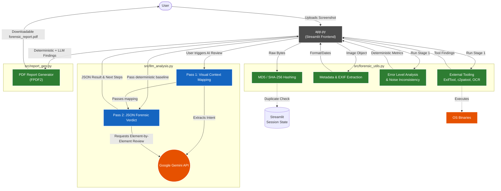

# Architecture

The Forensic Screenshot Authentication Tool is divided into four main logical components that map directly to the files in the repository.

## Architectural Breakdown

### 1. Frontend Orchestrator (`app.py`)
- Acts as the central coordinator. 
- Uses Streamlit's `session_state` to prevent redundant analysis of the same screenshot by caching previously generated hashes (MD5).
- Manages UI columns, configuration states (like `GEMINI_API_KEY`), and toggles between the deterministic baseline and AI steps.

### 2. Stage 1: Deterministic Engine (`src/forensic_utils.py`)
- Focuses strictly on mathematically reproducible evidence.
- **Internal Checks**: Uses `Pillow` (PIL) and `NumPy` to calculate Error Level Analysis (ELA) scores at various JPEG qualities, track spatial noise inconsistencies (to spot composited elements), and extract Shannon entropy.
- **External Checks**: Spawns non-blocking subprocesses to system binaries (like `exiftool` for metadata, `c2patool` for C2PA provenance credentials, `file` for MIME probing, and `tesseract` for text extraction).

### 3. Stage 2: AI Multi-Modal Engine (`src/llm_analysis.py`)
- Follows a strictly engineered **Two-Pass AI Strategy** using the Google Gemini SDK:
  - **Pass 1 (Context)**: The AI first builds a textual "map" of the image (what type of screen it is, what the key UI elements are, what fields are highly sensitive to forgery).
  - **Pass 2 (Forensics)**: The map is fed back into a rigorous JSON-enforced prompt alongside the deterministic findings from Stage 1 (if the user elected to ground the AI). The model then grades elements individually and enforces an ultimate verdict.

### 4. Reporting Engine (`src/report_gen.py`)
- Aggregates the multi-stage findings.
- Converts the textual/JSON outputs and visual metrics (like the 10x Amplified ELA diff image) into a sanitized, professional PDF using `FPDF2` and HTML rendering.
